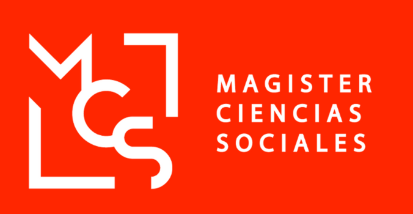
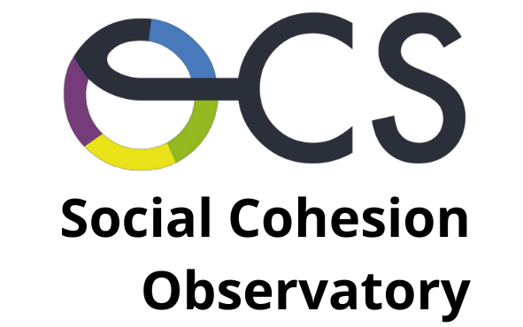
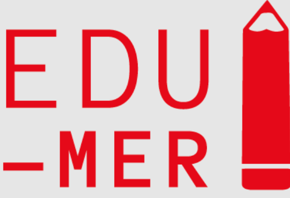
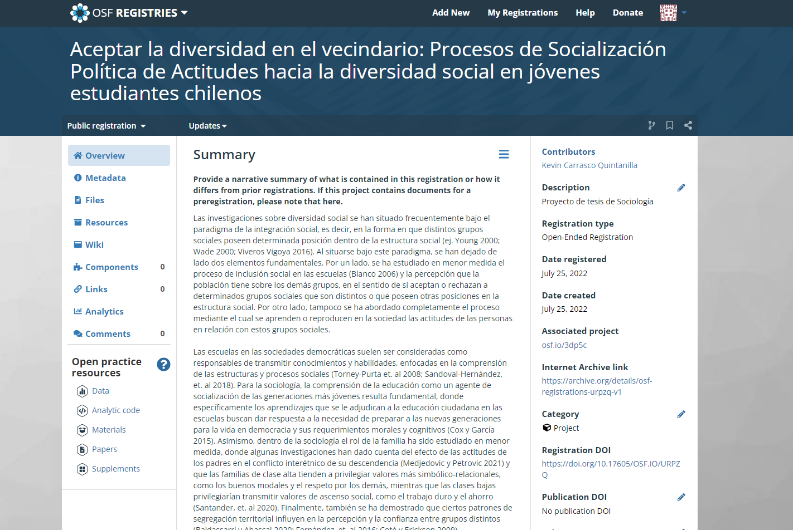
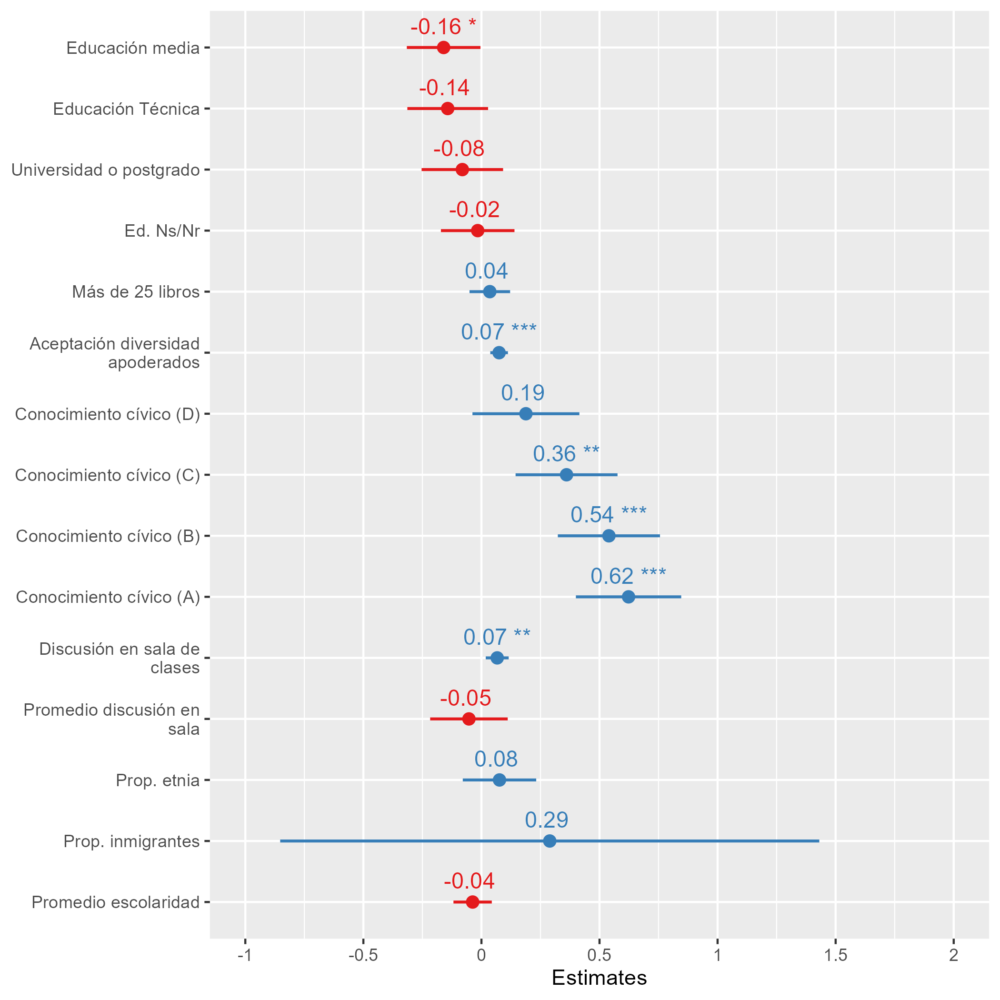
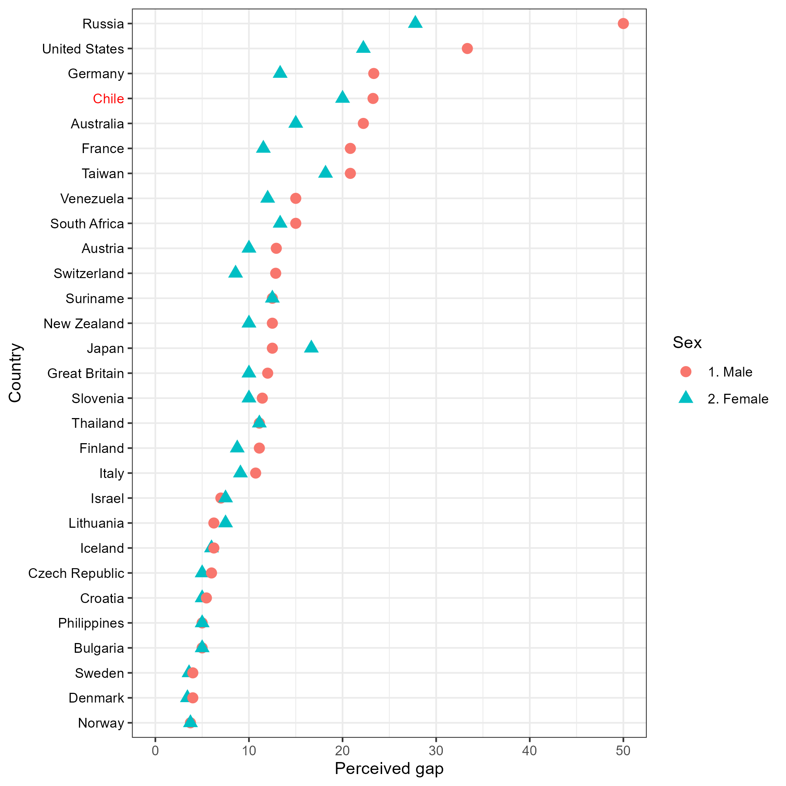
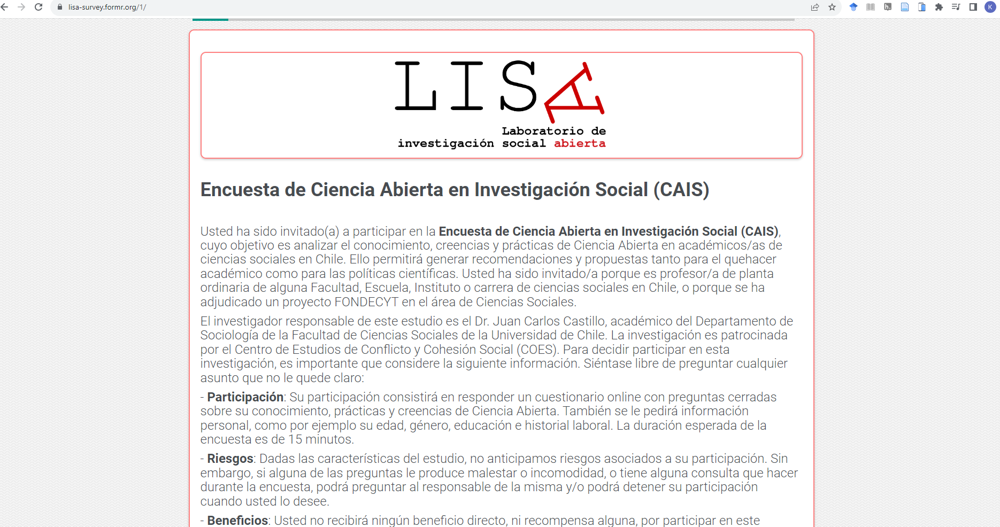

class: middle title-slide

```{r xaringanExtra, echo = FALSE}
  xaringanExtra::use_progress_bar(color = "red", location = c("top"))
```

.pull-left-narrow[

.center[
<br>


]
]

.pull-right-wide[
<br>

.content-box-purple[
.center[

## Kevin Carrasco

#### Sociologist and master in social sciences

----
.center[
#### Universidad de Chile
]
]
]

.pull-left[

]

.pull-right[

]
]
---

layout: true
class: animated, fadeIn

---
# Academic and professional journey

.pull-left[
### Research assistant at Center for social conflict and cohesion studies (COES)

.center[

]


]

.pull-right[
### This position includes working in the open social science laboratory and the social cohesion observatory

### Interdisciplinary work with protocols and workflows that facilitate collaborative work

]

---
# Academic and professional journey

.pull-left[
### Research assistant in two grant projects "Meritocracy at school" and "The work process in the *gig* economy"


]

.pull-right[

### These positions are related to research, mainly with the design of questionnaires and application of surveys. Literature review and paper writing.

### Different tools like R, Github, Zotero, Quarto and Shiny

]

---

# Research outcomes

- Master's thesis pre-registered at OSF

.pull-left[

* Available at [https://kevin-carrasco.github.io/aceptar-diversidad/](https://kevin-carrasco.github.io/aceptar-diversidad/)


]

.pull-right[

]

---

# Research outcomes

- Gender gaps in the perception of salary gaps with ISSP

.center[

]

---

# Research outcomes

- Open Science Survey with FormR

- Perceptions of healthy lifestyle habits in school principals

.center[

]


---

# Future research agenda

* Inequalities and social justice

* Social Cohesion

* Open Science

* Survey research methods.

---
<br>
<br>
<br>
.center[
## Thanks for your attention!
]

.center[

Slides created via the R package [**xaringan**](https://github.com/yihui/xaringan).

]
